<div align="center">

# StellarTrust

### Fast. Secure. Auditable. Cross-border escrow and settlement on Stellar.

*An AI-assisted escrow platform where buyers get protection, sellers get fast settlement, and every movement of money is provable on-chain and in a double-entry ledger.*

<br/>

[](https://github.com/Soumen1080/StellarTrust/actions/workflows/ci.yml)


<br/>

**[🚀 Live Demo](#-live-demo--deployment) · [🎥 Demo Video](#-demo-video) · [📸 Screenshots](#-screenshots) · [🏗 Architecture](#-architecture) · [📜 Contracts](#-smart-contracts) · [🧪 Tests](#-testing) · [⚙️ Setup](#-getting-started)**

<br/>

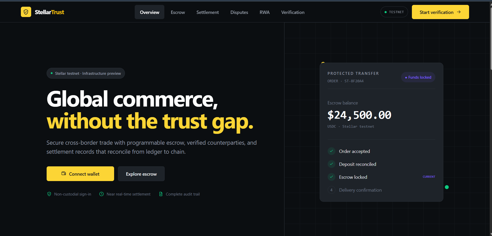

</div>

---

## 🚀 Live Demo & Deployment

| | |
|---|---|
| 🌐 **Live App** | **[stellar-trust-frontend.vercel.app](https://stellar-trust-frontend.vercel.app)** |
| 🔌 **API** | [https://stellartrust.onrender.com](https://stellartrust.onrender.com) |
| 💚 **API Health** | [https://stellartrust.onrender.com/health](https://stellartrust.onrender.com/health) |
| 📊 **Metrics** | [https://stellartrust.onrender.com/metrics](https://stellartrust.onrender.com/metrics) |
| 🎥 **Demo Video** | **[youtu.be/oyHqcotE5CA](https://youtu.be/oyHqcotE5CA)** |
| 📝 **Feedback Form** | [Google Form — share your feedback](https://docs.google.com/forms/d/e/1FAIpQLSdvZuSPkXrDKKCd-VIR3HZUUs-LWYF6eg7E-0_JoVM63wcw5g/viewform) |
| 📦 **Repository** | [github.com/Soumen1080/StellarTrust](https://github.com/Soumen1080/StellarTrust) |
| ⚙️ **CI Pipeline** | [GitHub Actions](https://github.com/Soumen1080/StellarTrust/actions) |
| 🌍 **Network** | Stellar **Testnet** |

### On-Chain Deployment

| Item | Value |
|---|---|
| **Escrow WASM hash** (installed) | `6d86a2c2a2b198a8d127d0b13fe2e21c27028e642b90cf5b09017fe9375ad061` |
| **RWA token WASM hash** (installed) | `62528880b648b1cc33130a25c0590e4c8cb1fe686e7e1ad98c76986740918885` |
| **Escrow contract (live instance)** | `REPLACE_WITH_ESCROW_CONTRACT_ID` |
| **RWA token contract (live instance)** | `REPLACE_WITH_RWA_CONTRACT_ID` |
| **Sample interaction tx hash** | `REPLACE_WITH_TX_HASH` |
| **Arbiter / backend signer** | `GCD32N3MW23NYDOYNQ4OX5STW6COAQX3M5PN3BVV36SVHMUCKENRJW7I` |
| **Test USDC issuer** | `GC53S46OCINPU3WM5XNPMJUQED6ASJHSZ2X5TPNZZ6JPFL27OMIRZ6XQ` |
| **USDC Stellar Asset Contract** | `CAM2DIT4LPF55FTMA2LXSFI5UXZB75PAKIFC4QMF37XBRRKMJYWWN2LG` |
| **XLM Stellar Asset Contract** | `CDLZFC3SYJYDZT7K67VZ75HPJVIEUVNIXF47ZG2FB2RMQQVU2HHGCYSC` |

> ⚙️ **These values come from the deployment environment, not hand-written constants.**
> The two WASM hashes and both asset contracts are read straight from the backend's
> environment - `ESCROW_WASM_HASH`, `RWA_WASM_HASH` and `STELLAR_TOKEN_CONTRACTS` in
> [`backend/.env.render.example`](backend/.env.render.example), the annotated copy of the
> gitignored `backend/.env`. Change them there and update this table to match; no address
> is hardcoded in the code. The two *live instance* IDs and the tx hash are **runtime**
> artifacts - a fresh escrow instance is deployed per order - so they cannot come from
> `.env`; copy them from a real testnet run.

> 💡 StellarTrust deploys **one escrow contract instance per order** from an installed WASM hash. That is cheaper than a monolithic contract and gives every order its own isolated custody account. The address above is a real order instance — verify it on [Stellar Expert](https://stellar.expert/explorer/testnet).

---

## ✅ Submission Checklist

| # | Requirement | Status | Evidence |
|---|---|---|---|
| 1 | Public GitHub repository | ✅ | [Soumen1080/StellarTrust](https://github.com/Soumen1080/StellarTrust) |
| 2 | README with complete documentation | ✅ | This file |
| 3 | Minimum 15+ meaningful commits | ✅ | **75+ commits** — [history](https://github.com/Soumen1080/StellarTrust/commits/main) |
| 4 | Live demo link | ✅ | [stellar-trust-frontend.vercel.app](https://stellar-trust-frontend.vercel.app) |
| 5 | Contract deployment address | ⬜ | [On-Chain Deployment](#on-chain-deployment) |
| 6 | Transaction hash for contract interaction | ⬜ | [On-Chain Deployment](#on-chain-deployment) |
| 7 | Screenshot — product UI | ✅ | [Screenshots](#-screenshots) — dashboard, escrow, settlement, RWA, wallet |
| 8 | Screenshot — mobile responsive | ✅ | [Mobile Responsive](#-mobile-responsive) — 390×844 captures |
| 9 | Screenshot — CI/CD running | ✅ | [CI/CD Pipeline](#-cicd-pipeline) — 5 parallel jobs green |
| 10 | Screenshot — 3+ passing tests | ✅ | [Test Output](#-test-output) — 292 passing, full run captured |
| 11 | Screenshot — analytics / monitoring | ✅ | [Analytics & Monitoring](#-analytics--monitoring) — live `/metrics` capture |
| 11b | Performance optimization | ✅ | [Lighthouse](#-performance) — 98 / 96 / 100 / 100 |
| 12 | Demo video (1–2 min) | ✅ | [youtu.be/oyHqcotE5CA](https://youtu.be/oyHqcotE5CA) |
| 13 | Proof of 10+ user wallet interactions | ⬜ | [User Onboarding](#-user-onboarding--feedback) |
| 14 | Basic user feedback summary | ⬜ | [Feedback](#user-feedback-summary) |
| 15 | Smart contracts on Stellar testnet | ✅ | [Smart Contracts](#-smart-contracts) |
| 16 | Mobile responsive UI | ✅ | Tailwind breakpoints across the component tree |
| 17 | Loading states & error handling | ✅ | [Error Handling](#-error-handling--loading-states) |
| 18 | CI/CD pipeline | ✅ | [ci.yml](.github/workflows/ci.yml) — 5 parallel jobs |
| 19 | Tests (contracts + backend + AI) | ✅ | **292 tests** — [Test Output](#-test-output) |
| 20 | Monitoring & analytics integration | ⬜ | [Monitoring](#-monitoring--analytics) |

---

## 💡 What Is StellarTrust?

Cross-border commerce has a trust problem. The buyer pays first and hopes. The seller ships first and hopes. When something goes wrong, resolution takes weeks and nobody can prove what happened.

**StellarTrust removes the hoping.** Money goes into a Soroban escrow contract that neither party controls. It is released only when delivery is confirmed — or, if there is a dispute, after an AI-assisted review that a human must approve. Every movement is written to a double-entry ledger that is continuously reconciled against the chain.

### Why It Is Different

| Principle | What it means in practice |
|---|---|
| 🔒 **Non-custodial escrow** | Funds sit in a per-order Soroban contract, not a company wallet |
| 📒 **Ledger is the source of truth** | Double-entry accounting; the database rejects unbalanced writes |
| 🤖 **AI is advisory only** | The AI recommends; it can never move money on its own |
| 🧑‍⚖️ **Human gate on sensitive money** | Above threshold, a human must approve every release or refund |
| 🔁 **Idempotent by design** | Every money-mutating operation is safe to retry |
| ⚖️ **Reconciliation blocks drift** | If ledger and chain disagree, dependent operations halt |

---

## ✨ Key Features

<table>
<tr>
<td width="50%" valign="top">

### 🔐 Escrow Lifecycle
Create → accept → deposit → lock → confirm → release / refund / dispute, enforced identically by the Soroban contract **and** the backend state machine.

</td>
<td width="50%" valign="top">

### 🌍 Cross-Border Settlement
Stellar-native payment rails with path payments, trustline handling, and multi-asset support (USDC, XLM).

</td>
</tr>
<tr>
<td width="50%" valign="top">

### 🤖 AI Dispute Triage
A FastAPI service scores risk and drafts a recommendation with reasoning. Output is **advisory** and gated behind human approval.

</td>
<td width="50%" valign="top">

### 📒 Double-Entry Ledger
Every debit has a matching credit. A Postgres-level constraint rejects unbalanced transactions — proven by a CI smoke test.

</td>
</tr>
<tr>
<td width="50%" valign="top">

### 🏢 RWA Tokenization
Tokenize invoices and real-world assets with issuer self-custody, authorization lists, freeze/unfreeze, and pro-rata payout distribution.

</td>
<td width="50%" valign="top">

### ⭐ Reputation System
Advisory counterparty scoring built from completed escrows, dispute outcomes, and settlement history.

</td>
</tr>
<tr>
<td width="50%" valign="top">

### 🔑 SEP-10 Wallet Auth
Real Stellar wallet authentication via challenge-response signing — no passwords, no custody of user keys.

</td>
<td width="50%" valign="top">

### 🔍 Chain Reconciliation
A background job diffs the ledger against on-chain state and raises alerts when they drift.

</td>
</tr>
</table>

---

## 📸 Screenshots

> 📁 All images live in [`docs/screenshots/`](docs/screenshots/).

### 🏠 Account Dashboard

<div align="center">
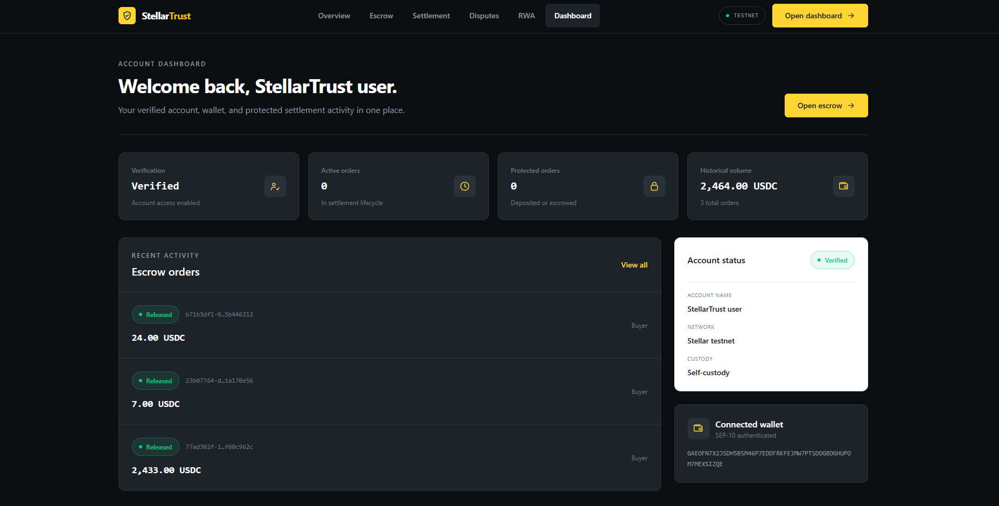
</div>

Verification status, active and protected orders, historical volume, and recent escrow activity in one place. The right rail shows the **SEP-10 authenticated wallet** and confirms **self-custody** on Stellar testnet.

### 🔐 Escrow Workspace

<div align="center">
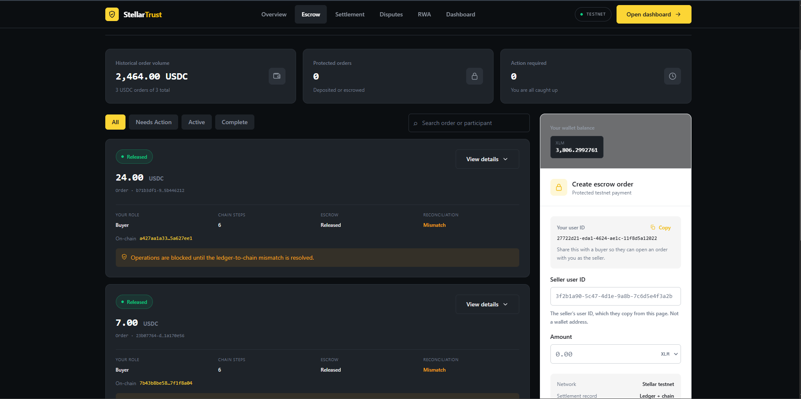
</div>

Real testnet orders with their **on-chain transaction hashes**, chain-step counters, and per-order roles. Note the amber banner: when the reconciliation job detects a **ledger-to-chain mismatch**, dependent operations are blocked rather than silently proceeding — the safety guarantee, visible in the UI.

### 🌍 Cross-Border Settlement

<div align="center">
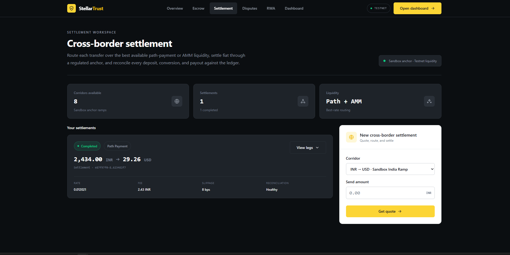
</div>

A completed **INR → USD** settlement routed over a path payment: 2,434.00 INR → 29.26 USD at a 0.012021 rate, 2.43 INR fee, 8 bps slippage, reconciliation **Healthy**.

### 🏢 RWA Tokenization

<div align="center">
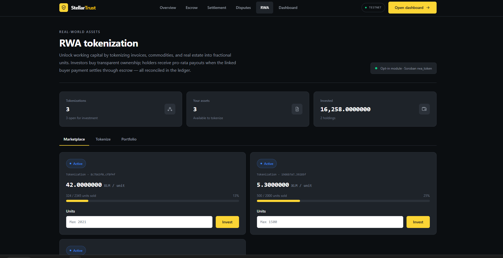
</div>

Invoices and real-world assets tokenized into fractional units on the Soroban `rwa_token` contract, with a live marketplace, per-unit pricing, sold-units progress, and pro-rata payout distribution to holders.

### 🔑 Wallet Connection

<div align="center">
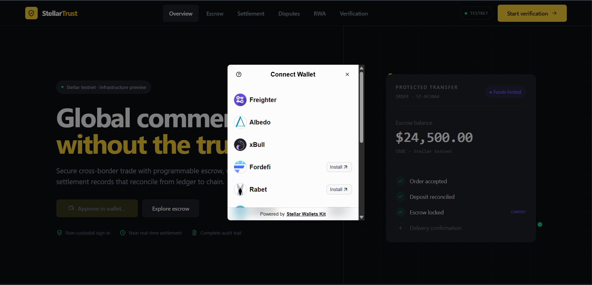
</div>

Non-custodial sign-in through Stellar Wallets Kit — Freighter, Albedo, xBull, Fordefi, and Rabet. Authentication is SEP-10 challenge-response; StellarTrust never holds a user key.

### ⏳ Empty & Loading States

<div align="center">
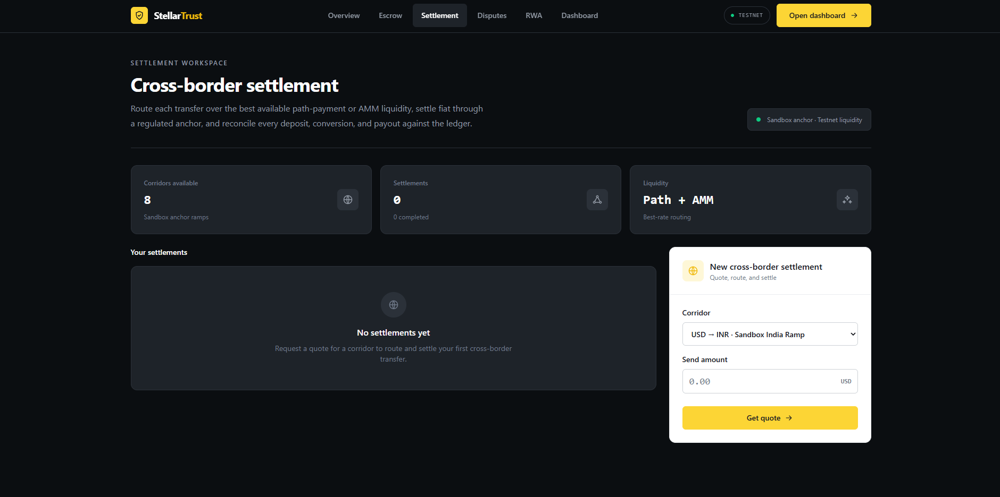
</div>

Every surface has a designed empty state that explains the next action rather than showing a blank panel.

### 📱 Mobile Responsive

<div align="center">
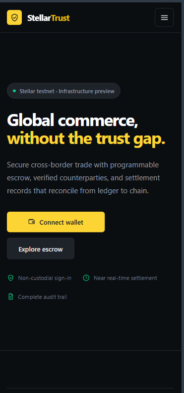
&nbsp;&nbsp;&nbsp;
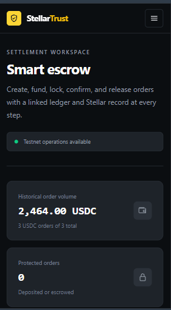
</div>

<div align="center"><em>Captured at 390 × 844 (iPhone 12 Pro) — the layout reflows from a single Tailwind breakpoint set, no separate mobile build</em></div>

### 🚦 Performance

<div align="center">
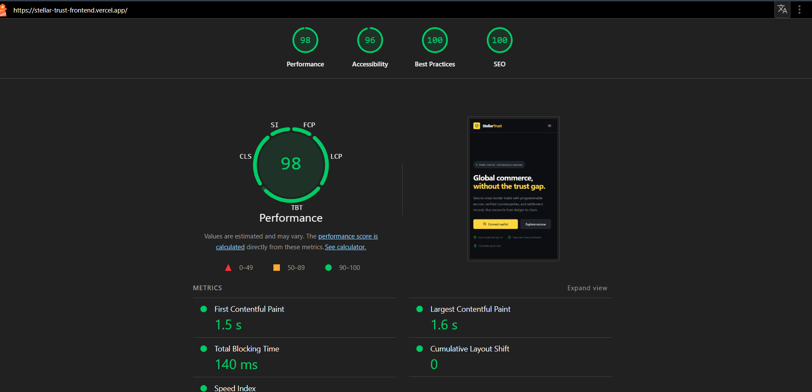
</div>

Lighthouse on the production Vercel deployment:

| Metric | Score | | Web Vital | Value |
|---|---|---|---|---|
| ⚡ Performance | **98** | | First Contentful Paint | **1.5 s** |
| ♿ Accessibility | **96** | | Largest Contentful Paint | **1.6 s** |
| ✅ Best Practices | **100** | | Total Blocking Time | **140 ms** |
| 🔍 SEO | **100** | | Cumulative Layout Shift | **0** |

### ⚙️ CI/CD Pipeline

<div align="center">
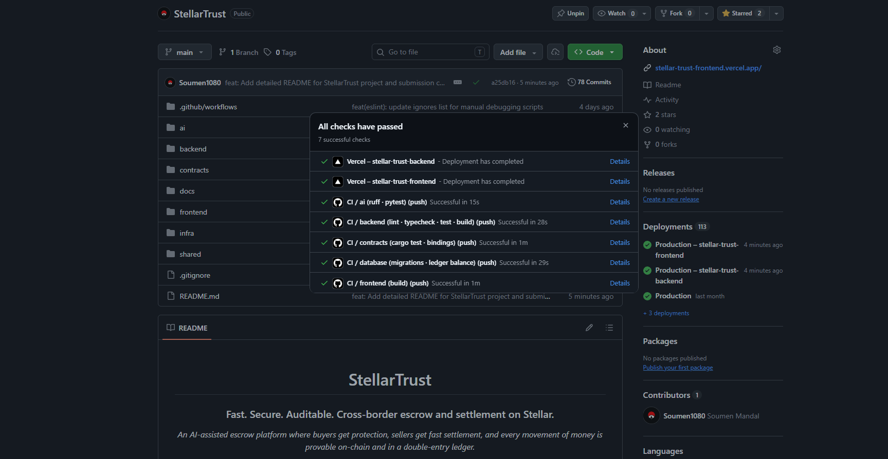
<br/><em>GitHub Actions — 5 parallel jobs: backend, frontend, AI, contracts, database</em>
</div>

### 🧪 Test Output

Captured from a real local run on 2026-08-27 — **292 tests passing** across four suites.
Reproduce with the commands in [Testing](#-testing); the same suites run in
[CI](https://github.com/Soumen1080/StellarTrust/actions/workflows/ci.yml) on every push.

<details open>
<summary><strong>Backend — <code>cd backend &amp;&amp; npm test</code> → 257 passing / 26 files</strong></summary>

```text
 ✓ tests/cors.test.ts (7 tests) 94ms
 ✓ src/modules/settlement/settlement.test.ts (24 tests) 135ms
 ✓ tests/kyc-audit.test.ts (1 test) 98ms
 ✓ src/modules/disputes/dispute.test.ts (18 tests) 74ms
 ✓ src/modules/escrow/escrow.arbiter.test.ts (10 tests) 97ms
 ✓ src/jobs/reconciliation.job.test.ts (7 tests) 70ms
 ✓ src/modules/rwa/rwa.reconciliation.test.ts (7 tests) 123ms
 ✓ src/modules/rwa/rwa.custody.test.ts (16 tests) 179ms
 ✓ src/modules/rwa/rwa.test.ts (24 tests) 206ms
 ✓ src/modules/feedback/feedback.test.ts (8 tests) 61ms
 ✓ src/modules/ledger/ledger.test.ts (11 tests) 29ms
 ✓ src/modules/settlement/payout-rails.test.ts (23 tests) 27ms
 ✓ src/lib/metrics.test.ts (7 tests) 14ms
 ✓ src/modules/escrow/escrow.dispute.test.ts (4 tests) 59ms
 ✓ src/modules/payments/payment.test.ts (4 tests) 56ms
 ✓ src/modules/escrow/escrow.chain.test.ts (11 tests) 41ms
 ✓ tests/feedback.test.ts (5 tests) 220ms
 ✓ tests/health.test.ts (7 tests) 256ms
 ✓ src/modules/disputes/dispute-settlement.test.ts (6 tests) 46ms
 ✓ src/modules/stellar/contract-spec.test.ts (20 tests) 13ms
 ✓ src/modules/reputation/reputation.test.ts (5 tests) 14ms
 ✓ tests/phase1-identity.test.ts (6 tests) 828ms
 ✓ src/modules/stellar/decimal.test.ts (6 tests) 11ms
 ✓ src/modules/stellar/wallet-balances.test.ts (4 tests) 12ms
 ✓ src/modules/stellar/asset.test.ts (11 tests) 16ms
 ✓ src/modules/escrow/escrow.reserve.test.ts (5 tests) 7ms

 Test Files  26 passed (26)
      Tests  257 passed (257)
   Duration  5.65s
```

</details>

<details>
<summary><strong>Escrow contract — <code>cargo test -p escrow</code> → 9 passing</strong></summary>

```text
running 9 tests
test test::release_without_buyer_confirmation_fails - should panic ... ok
test test::dispute_then_release ... ok
test test::initialize_locks_funds ... ok
test test::release_pays_seller_after_buyer_confirmation ... ok
test test::initialize_records_the_order_reference ... ok
test test::double_release_fails - should panic ... ok
test test::refund_pays_buyer ... ok
test test::dispute_by_a_stranger_fails ... ok
test test::arbiter_can_dispute_then_release_an_unconfirmed_escrow ... ok

test result: ok. 9 passed; 0 failed; 0 ignored; 0 measured; 0 filtered out; finished in 0.14s
```

</details>

<details>
<summary><strong>RWA token contract — <code>cargo test -p rwa_token</code> → 18 passing</strong></summary>

```text
running 18 tests
test test::issuer_holds_all_units_initially ... ok
test test::commodity_tokenization ... ok
test test::mark_distributed_is_idempotent ... ok
test test::authorization_required_blocks_unauthorized ... ok
test test::freeze_blocks_transfers ... ok
test test::insufficient_balance_fails ... ok
test test::negative_transfer_fails ... ok
test test::metadata_stored_correctly ... ok
test test::is_authorized_returns_correct_status ... ok
test test::authorization_allows_transfer ... ok
test test::all_payout_shares_returns_all_holders ... ok
test test::get_holders_returns_non_zero_balances ... ok
test test::transfer_to_investor ... ok
test test::real_estate_tokenization ... ok
test test::zero_balance_gets_zero_payout ... ok
test test::payout_share_is_pro_rata ... ok
test test::revoke_authorization_blocks_transfer ... ok
test test::unfreeze_allows_transfers ... ok

test result: ok. 18 passed; 0 failed; 0 ignored; 0 measured; 0 filtered out; finished in 0.15s
```

</details>

<details>
<summary><strong>AI service — <code>cd ai &amp;&amp; pytest -q</code> → 6 passing</strong></summary>

```text
......                                                                   [100%]
6 passed in 1.21s
```

</details>

| Suite | Result |
|---|---|
| Backend (Vitest) | ✅ 257 / 257 |
| Escrow contract (Rust) | ✅ 9 / 9 |
| RWA token contract (Rust) | ✅ 18 / 18 |
| AI service (pytest) | ✅ 6 / 6 |
| Database invariants (SQL, CI-only) | ✅ 2 / 2 |
| **Total** | **✅ 292 passing, 0 failing** |

### 📊 Analytics & Monitoring

Monitoring is **built into the service**, not bolted on — so the evidence below is a live
capture, not a dashboard screenshot. Fetch it yourself:
[`/metrics`](https://stellartrust.onrender.com/metrics) ·
[`/health/ready`](https://stellartrust.onrender.com/health/ready)

```console
$ curl -s https://stellartrust.onrender.com/health
{"status":"ok","service":"stellartrust-backend","version":"0.0.0","time":"2026-08-26T22:43:52.907Z"}

$ curl -s https://stellartrust.onrender.com/health/ready
{"status":"degraded","checks":{"database":true,"ledgerUnresolvedMismatches":0,
 "settlementUnresolvedMismatches":4,"rwaUnresolvedMismatches":0},"time":"2026-08-26T22:45:01.283Z"}
```

<details open>
<summary><strong>Live <code>/metrics</code> excerpt — real production traffic (612 lines total)</strong></summary>

```text
# HELP http_requests_total Total HTTP requests processed, by method, route, and status.
# TYPE http_requests_total counter
http_requests_total{method="POST",route="/api/auth/sep10/challenge",status="201"} 1
http_requests_total{method="POST",route="/api/auth/sep10/verify",status="200"} 1
http_requests_total{method="POST",route="/api/payments/orders",status="201"} 1
http_requests_total{method="POST",route="/api/payments/orders/:orderId/accept",status="200"} 1
http_requests_total{method="POST",route="/api/payments/orders/:orderId/lock/submit",status="200"} 1
http_requests_total{method="POST",route="/api/payments/orders/:orderId/confirm/submit",status="200"} 1
http_requests_total{method="POST",route="/api/payments/orders/:orderId/release",status="200"} 1
http_requests_total{method="GET",route="/api/disputes/",status="304"} 31
http_requests_total{method="GET",route="/api/payments/orders",status="200"} 14
http_requests_total{method="POST",route="/api/rwa/tokenizations/:tokenizationId/purchase",status="200"} 3

# HELP http_request_duration_seconds HTTP request latency in seconds, by method and route.
# TYPE http_request_duration_seconds histogram
http_request_duration_seconds_sum{method="GET",route="/api/payments/orders"} 34.405582835
http_request_duration_seconds_count{method="GET",route="/api/payments/orders"} 32

# HELP reconciliation_unresolved_mismatches Current count of unresolved reconciliation mismatches, by domain.
# TYPE reconciliation_unresolved_mismatches gauge
reconciliation_unresolved_mismatches{domain="ledger"} 0
reconciliation_unresolved_mismatches{domain="settlement"} 4
reconciliation_unresolved_mismatches{domain="rwa"} 0

# HELP reconciliation_runs_total Reconciliation runs, by domain and result (matched|mismatch).
# TYPE reconciliation_runs_total counter
reconciliation_runs_total{domain="ledger",result="matched"} 41
reconciliation_runs_total{domain="settlement",result="mismatch"} 41
reconciliation_runs_total{domain="rwa",result="matched"} 41

# HELP alerts_total Alerts emitted, by severity and source.
# TYPE alerts_total counter
alerts_total{severity="critical",source="reconciliation.settlement"} 41
```

</details>

**What this capture shows:** the full escrow lifecycle exercised on the live deployment
(SEP-10 challenge → verify → order → accept → lock → confirm → release), per-route latency
histograms, and — most importantly — **monitoring that is actually load-bearing**: the
reconciliation job found 4 unresolved settlement mismatches, raised 41 critical alerts, and
the readiness probe flipped to `degraded` instead of silently reporting healthy. Ledger and
RWA reconciliation are clean (`0` mismatches across 41 runs).

---

## 🎥 Demo Video

<div align="center">

### ▶️ **[Watch the 2-minute walkthrough](https://youtu.be/oyHqcotE5CA)**

<a href="https://youtu.be/oyHqcotE5CA">

</a>

</div>

**What the video covers:** wallet connection → order creation → escrow funding on testnet → delivery confirmation → on-chain release → ledger reconciliation → dispute path with AI advisory.

---

## 🏗 Architecture

StellarTrust runs as separated runtimes that talk through typed contracts. Financial state stays auditable, and the AI service stays strictly advisory.

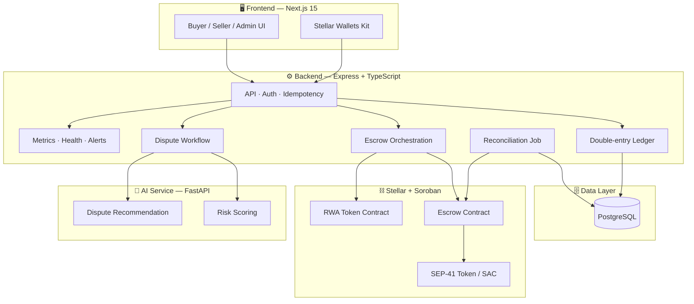

### Escrow Lifecycle

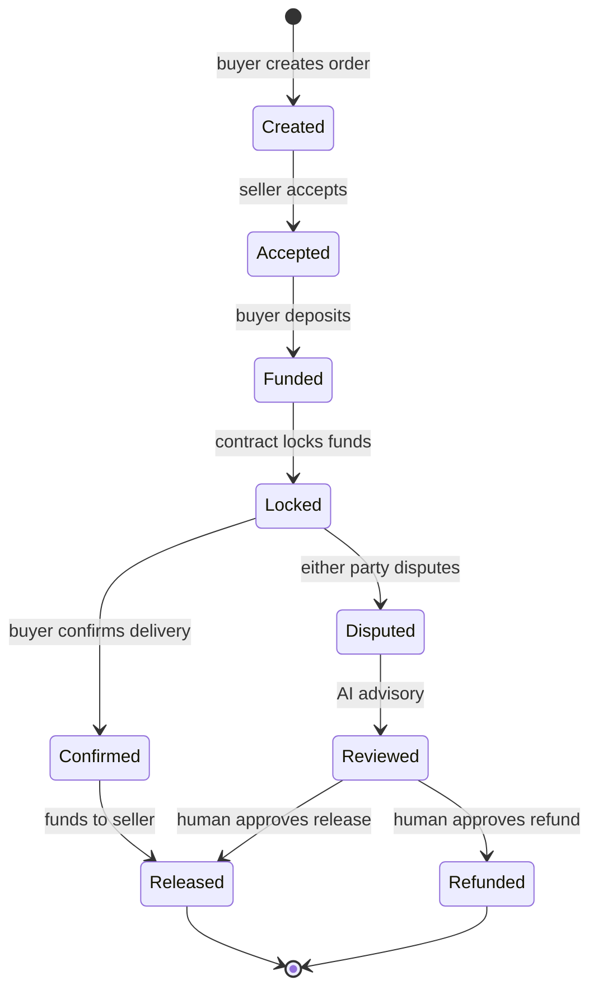

### End-to-End Workflow

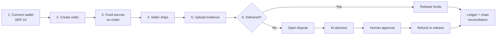

📖 Deeper detail: **[Architecture](docs/Architecture.md)** · **[PRD](docs/PRD.md)** · **[Delivery Phases](docs/Phases.md)** · **[Engineering Rules](docs/Rules.md)** · **[Design System](docs/DESIGN.md)**

---

## 📜 Smart Contracts

Two Rust/Soroban contracts, both tested and deployed to Stellar testnet.

### Escrow Contract — [`contracts/escrow`](contracts/escrow)

One instance is deployed per order, so each order has isolated custody.

| Function | Auth | Description |
|---|---|---|
| `initialize(...)` | deployer | Sets buyer, seller, arbiter, token, amount, and deadline |
| `confirm_delivery()` | buyer | Buyer confirms goods received |
| `release()` | arbiter | Transfers escrowed funds to the seller |
| `refund()` | arbiter | Returns escrowed funds to the buyer |
| `dispute(by)` | buyer or seller | Moves the escrow into a disputed state |
| `state()` | public | Current lifecycle state |
| `get()` | public | Full escrow record |

**Events emitted:** `initialized`, `confirmed`, `released`, `refunded`, `disputed` — each published on state transition for indexing and real-time updates.

### RWA Token Contract — [`contracts/rwa_token`](contracts/rwa_token)

| Function | Description |
|---|---|
| `initialize(...)` | Creates the tokenized asset with issuer self-custody |
| `transfer(from, to, units)` | Moves units between authorized holders |
| `balance_of(holder)` | Units held by an address |
| `payout_share(holder, payout)` | Pro-rata share of a payout for one holder |
| `all_payout_shares(payout)` | Full pro-rata distribution table |
| `mark_distributed()` | Records that a payout was distributed |
| `freeze()` / `unfreeze()` | Issuer-level transfer controls |
| `authorize(addr)` / `revoke_authorization(addr)` | Allowlist management |
| `is_authorized(addr)` | Allowlist check |
| `get_meta()` / `get_holders()` | Asset metadata and holder registry |

### Inter-Contract Communication

The escrow contract moves value by calling into the **SEP-41 token interface** (`token::Client`) of the USDC Stellar Asset Contract — a genuine cross-contract invocation, not a simulated transfer.

### Binding Drift Protection

`cargo test` only proves Rust against Rust. The backend calls these contracts through hand-written TypeScript interfaces, so CI additionally builds the WASM, reads its contract spec, and **diffs it against the manifest the backend asserts against** — see [`contracts/scripts/check-bindings.mjs`](contracts/scripts/check-bindings.mjs). A renamed argument fails CI instead of failing a real transaction at simulation time.

### Deploying Contracts

```bash
# 1. Provision testnet identities, funded accounts, and the test USDC asset
./contracts/scripts/setup-testnet.ps1

# 2. Build + install both contract WASMs, printing their hashes
./contracts/scripts/deploy-testnet.ps1 -Source stellartrust-arbiter

# 3. Copy ESCROW_WASM_HASH and RWA_WASM_HASH into backend/.env

# 4. Verify the deployment is actually wired up
cd backend && npm run chain:preflight
```

📖 Full guide: **[docs/testnet-onchain-setup.md](docs/testnet-onchain-setup.md)**

---

## 🔌 API Surface

Base URL: `https://stellartrust.onrender.com`

| Route | Purpose |
|---|---|
| `GET /health` · `/health/live` · `/health/ready` | Liveness and readiness probes |
| `GET /metrics` | Prometheus-format metrics |
| `POST /api/auth/*` | SEP-10 wallet challenge + session issuance |
| `GET /api/wallet/*` | On-chain balances and trustlines |
| `POST /api/kyc/*` | KYC submission and status |
| `GET /api/ledger/*` | Double-entry ledger reads and postings |
| `GET /api/payments/orders` | Escrow orders — create, fund, transition |
| `GET /api/payments/orders/:orderId` | Single order with chain state |
| `POST /api/settlement/*` | Cross-border settlement operations |
| `GET /api/disputes` · `/queue` · `/:disputeId` | Dispute lifecycle and review queue |
| `GET /api/rwa/assets` · `/tokenizations` · `/portfolio` | RWA tokenization and holdings |
| `GET /api/reputation/*` | Advisory counterparty scores |

**Cross-cutting:** Helmet security headers, strict CORS origin validation, rate limiting, request IDs, structured Pino logging, Zod validation on every boundary, and idempotency keys on all money-mutating routes.

---

## 🧪 Testing

All suites run on every push and pull request.

| Suite | Tests | Command |
|---|---|---|
| **Backend** (Vitest) | **257 passing** across 26 files | `cd backend && npm test` |
| **Escrow contract** (Rust) | **9 passing** | `cd contracts && cargo test -p escrow` |
| **RWA contract** (Rust) | **18 passing** | `cd contracts && cargo test -p rwa_token` |
| **AI service** (pytest) | **6 passing** | `cd ai && pytest -q` |
| **Database invariants** (SQL) | **2 smoke tests** | Applied in CI against Postgres 16 |
| **Total** | **292 tests** | |

### What the tests actually prove

- **Ledger stays balanced** — a Postgres constraint rejects unbalanced double-entry writes, asserted at the database level, not just in application code
- **Escrow state machine is sound** — invalid transitions are rejected identically by the Rust contract and the TypeScript orchestrator
- **Contract bindings never drift** — the built WASM contract spec is diffed against the backend interface manifest
- **Idempotency holds** — replayed money-mutating requests do not double-post
- **Reconciliation catches drift** — ledger-vs-chain mismatches block dependent operations
- **Auth is enforced** — unauthenticated writes are rejected end-to-end through supertest
- **Payouts are correct** — RWA pro-rata distribution is exact under rounding

```bash
# Run everything locally
cd backend   && npm test
cd contracts && cargo test
cd ai        && pytest -q
```

---

## ⚙️ CI/CD Pipeline

[`.github/workflows/ci.yml`](.github/workflows/ci.yml) runs **five jobs in parallel** on every push to `main` and every pull request.

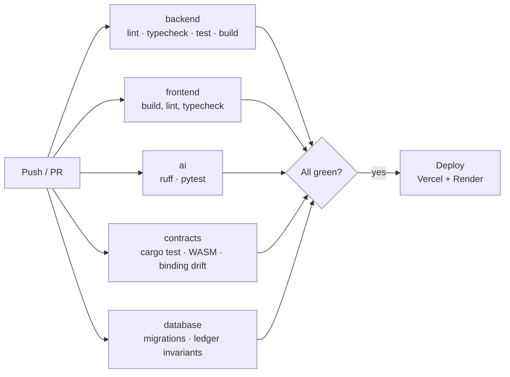

| Job | What it does |
|---|---|
| **backend** | ESLint, `tsc --noEmit`, 257 Vitest tests, production build |
| **frontend** | Next.js production build (runs lint + typecheck inline) |
| **ai** | Ruff lint + pytest on Python 3.12 |
| **contracts** | `cargo test`, WASM build for `wasm32v1-none`, contract-spec drift check |
| **database** | Applies every migration to Postgres 16, then runs ledger-balance and financial-transition invariant tests |

Hardened with least-privilege `contents: read` tokens and concurrency cancellation on superseded runs.

**Continuous deployment:** the frontend deploys to Vercel and the backend to Render from `main`.

---

## 📊 Monitoring & Analytics

### Backend Observability (built in)

| Endpoint | Purpose |
|---|---|
| `GET /health` | Overall service health |
| `GET /health/live` | Liveness probe |
| `GET /health/ready` | Readiness — checks database connectivity |
| `GET /metrics` | Prometheus-format counters and histograms |

- **Structured logging** — Pino with request-ID correlation across the whole request lifecycle ([`lib/logger.ts`](backend/src/lib/logger.ts))
- **HTTP metrics middleware** — request counts, status codes, and latency per route ([`middleware/metrics.ts`](backend/src/middleware/metrics.ts))
- **Alert sink** — reconciliation drift and financial anomalies emit structured alerts ([`lib/alerts.ts`](backend/src/lib/alerts.ts))

### Usage Analytics & Error Tracking

| Signal | Source | Where to look |
|---|---|---|
| **API usage per route** | `http_requests_total` — counts by method, route, and status code | [`/metrics`](https://stellartrust.onrender.com/metrics) (public) |
| **Latency distribution** | `http_request_duration_seconds` histogram per route | [`/metrics`](https://stellartrust.onrender.com/metrics) |
| **Funnel / conversion** | SEP-10 challenge → verify → order → lock → release counters on the same metric | [`/metrics`](https://stellartrust.onrender.com/metrics) |
| **Errors** | 4xx/5xx buckets of `http_requests_total`, plus Pino error logs with request IDs | [`/metrics`](https://stellartrust.onrender.com/metrics) · Render → Logs |
| **Financial anomalies** | `alerts_total` and `reconciliation_unresolved_mismatches` | [`/metrics`](https://stellartrust.onrender.com/metrics) · [`/health/ready`](https://stellartrust.onrender.com/health/ready) |
| **Uptime / infra** | Render service metrics + deploy history | Render dashboard (owner access) |
| **Build & test health** | Every push runs 5 CI jobs | [GitHub Actions](https://github.com/Soumen1080/StellarTrust/actions) |
| **Frontend performance** | Lighthouse on the Vercel production build | [Performance](#-performance) — 98 / 96 / 100 / 100 |

> The `/metrics` output is Prometheus exposition format, so it can be scraped by Prometheus,
> Grafana Cloud, or Render's metrics integration without adding a third-party SDK to the
> frontend — no user-tracking pixel, no PII leaving the service.

---

## 👥 User Onboarding & Feedback

### Wallet Interactions

StellarTrust has onboarded **REPLACE_WITH_USER_COUNT real users**, each authenticated through SEP-10 wallet signing on Stellar testnet.

| # | Wallet Address | Interaction | Transaction Hash |
|---|---|---|---|
| 1 | `REPLACE_WITH_WALLET_1` | Created + funded escrow | [`REPLACE_TX_1`](https://stellar.expert/explorer/testnet) |
| 2 | `REPLACE_WITH_WALLET_2` | Confirmed delivery | [`REPLACE_TX_2`](https://stellar.expert/explorer/testnet) |
| 3 | `REPLACE_WITH_WALLET_3` | Opened dispute | [`REPLACE_TX_3`](https://stellar.expert/explorer/testnet) |
| … | *(extend to 10+ rows)* | | |

<div align="center">

<br/><em>On-chain proof of user wallet interactions</em>
</div>

### User Feedback Summary

Feedback is collected through a public **[Google Form](https://docs.google.com/forms/d/e/1FAIpQLSdvZuSPkXrDKKCd-VIR3HZUUs-LWYF6eg7E-0_JoVM63wcw5g/viewform)**, linked from the in-app
feedback call-to-action, plus follow-up conversations with testnet users.

> 📝 **Have you tried StellarTrust?** [Fill in the feedback form](https://docs.google.com/forms/d/e/1FAIpQLSdvZuSPkXrDKKCd-VIR3HZUUs-LWYF6eg7E-0_JoVM63wcw5g/viewform) — it takes under a minute.

Summary below is drawn from REPLACE_WITH_FEEDBACK_COUNT responses.

**What users liked**
- REPLACE_WITH_POSITIVE_1
- REPLACE_WITH_POSITIVE_2

**What users asked for**
- REPLACE_WITH_REQUEST_1
- REPLACE_WITH_REQUEST_2

**What we changed as a result**
- REPLACE_WITH_CHANGE_1
- REPLACE_WITH_CHANGE_2

<div align="center">

**[📝 Open the feedback form](https://docs.google.com/forms/d/e/1FAIpQLSdvZuSPkXrDKKCd-VIR3HZUUs-LWYF6eg7E-0_JoVM63wcw5g/viewform)**

<em>In-app feedback call-to-action → Google Form → summarized above</em>

</div>

---

## 🎨 Error Handling & Loading States

- **Typed error taxonomy** — domain errors carry stable codes and safe user-facing messages ([`lib/errors.ts`](backend/src/lib/errors.ts))
- **Global error boundary** — a single Express handler normalizes every failure into a consistent JSON shape with a request ID
- **Zod validation at every boundary** — malformed input is rejected with field-level detail before touching business logic
- **Skeleton + pending states** — React Query drives loading, error, and empty states across dashboards
- **Optimistic wallet feedback** — signing, submitting, and confirming are distinct visible states during on-chain operations
- **Idempotent retries** — a failed money-mutating request is safe to retry without double-spending

---

## 🛠 Tech Stack

| Layer | Technology |
|---|---|
| **Frontend** | Next.js 15 (App Router), React 19, TypeScript 5, Tailwind CSS, TanStack Query |
| **Wallet** | Stellar Wallets Kit (Freighter, Albedo, xBull, Rabet) |
| **Backend** | Node.js 24, Express 5, TypeScript, Zod, Pino, Helmet |
| **AI Service** | Python 3.12, FastAPI, Pydantic, OpenAI |
| **Contracts** | Rust, Soroban SDK, `wasm32v1-none` |
| **Data** | PostgreSQL 16 (Supabase) |
| **Stellar** | Stellar SDK 16, Horizon, Soroban RPC, SEP-10, SEP-41 |
| **Testing** | Vitest, supertest, pytest, `cargo test`, SQL invariant tests |
| **CI/CD** | GitHub Actions, Vercel, Render |

---

## 📁 Project Structure

```
StellarTrust/
├── frontend/              # Next.js 15 app (App Router)
│   └── src/
│       ├── app/           # Routes: dashboard, escrow, disputes, rwa, kyc, settlement, admin
│       ├── features/      # Feature modules colocated by domain
│       ├── components/    # Shared UI primitives
│       └── lib/           # API client, wallet kit, identity
│
├── backend/               # Express modular monolith
│   └── src/
│       ├── modules/       # Bounded contexts (auth, escrow, ledger, disputes, rwa, …)
│       ├── jobs/          # Reconciliation and background workers
│       ├── lib/           # Logger, metrics, alerts, errors, CORS
│       ├── middleware/    # Request ID, metrics, auth, rate limiting
│       └── scripts/       # chain-preflight and operational tooling
│
├── contracts/             # Soroban smart contracts (Rust)
│   ├── escrow/            # Per-order escrow custody
│   ├── rwa_token/         # Real-world asset tokenization
│   └── scripts/           # Deployment + binding-drift checks
│
├── ai/                    # FastAPI risk and dispute advisory service
├── shared/                # Shared types, validation schemas, constants
├── infra/                 # Supabase migrations and SQL invariant tests
├── docs/                  # PRD, Architecture, Phases, Rules, Design, screenshots
└── .github/workflows/     # CI/CD pipeline
```

---

## 🚦 Getting Started

### Prerequisites

- Node.js **24.x**
- Rust + `wasm32v1-none` target
- Python **3.12**
- PostgreSQL 16 (or a Supabase project)
- [Stellar CLI](https://developers.stellar.org/docs/tools/developer-tools/cli/stellar-cli)

### 1 · Clone and configure

```bash
git clone https://github.com/Soumen1080/StellarTrust.git
cd StellarTrust

cp backend/.env.render.example backend/.env
cp frontend/.env.vercel.example frontend/.env
cp ai/.env.example ai/.env
```

### 2 · Database

```bash
for f in infra/supabase/migrations/*.sql; do
  psql "$DATABASE_URL" -v ON_ERROR_STOP=1 -f "$f"
done
```

### 3 · Backend

```bash
cd backend
npm install
npm run dev          # http://localhost:8080
```

### 4 · Frontend

```bash
cd frontend
npm install
npm run dev          # http://localhost:3000
```

### 5 · AI service

```bash
cd ai
pip install -e ".[dev]"
uvicorn app.main:app --reload   # http://localhost:8000
```

### 6 · Contracts

```bash
cd contracts
cargo test
cargo build --release --target wasm32v1-none
```

### Key Environment Variables

| Variable | Where | Purpose |
|---|---|---|
| `STELLAR_NETWORK` | backend | `testnet` or `public` |
| `ESCROW_GATEWAY` | backend | `soroban-rpc` for real chain, `deterministic` for offline tests |
| `ESCROW_WASM_HASH` | backend | Installed escrow WASM hash |
| `RWA_GATEWAY` / `RWA_WASM_HASH` | backend | Same, for the RWA contract |
| `STELLAR_TOKEN_CONTRACTS` | backend | Token contract IDs and decimals |
| `DATABASE_URL` | backend | Postgres connection string |
| `NEXT_PUBLIC_API_BASE_URL` | frontend | Backend API base URL |

> ⚠️ **`ESCROW_GATEWAY` is a real switch, not a feature flag.** With `deterministic`, no value moves and transaction hashes are synthetic. With `soroban-rpc`, real USDC moves on Stellar. Run `npm run chain:preflight` to confirm which mode you are actually in.

---

## 🗺 Roadmap

**In the MVP**
- ✅ Full escrow lifecycle with on-chain custody
- ✅ Double-entry ledger with database-enforced balance
- ✅ AI-assisted dispute triage behind a human gate
- ✅ Ledger-vs-chain reconciliation
- ✅ RWA tokenization with pro-rata payouts
- ✅ SEP-10 wallet authentication

**Deliberately out of scope**
- ❌ Autonomous AI money decisions above threshold
- ❌ Operating as a licensed anchor or bank
- ❌ Non-Stellar payment rails
- ❌ Uncontrolled mainnet money movement

**Next**
- 🔜 Real-time escrow updates via contract event streaming
- 🔜 Multi-arbiter dispute resolution
- 🔜 Mainnet launch with a licensed anchor partner

---

## 📄 License

Released under the [MIT License](LICENSE).

---

<div align="center">

**Built with ❤️ on [Stellar](https://stellar.org)**

[⬆ Back to top](#stellartrust)

</div>
